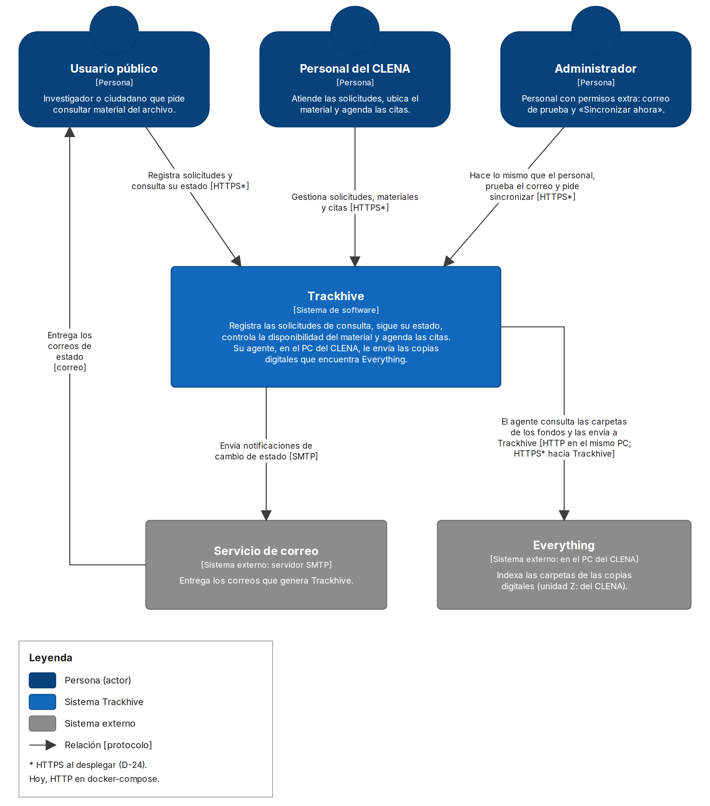
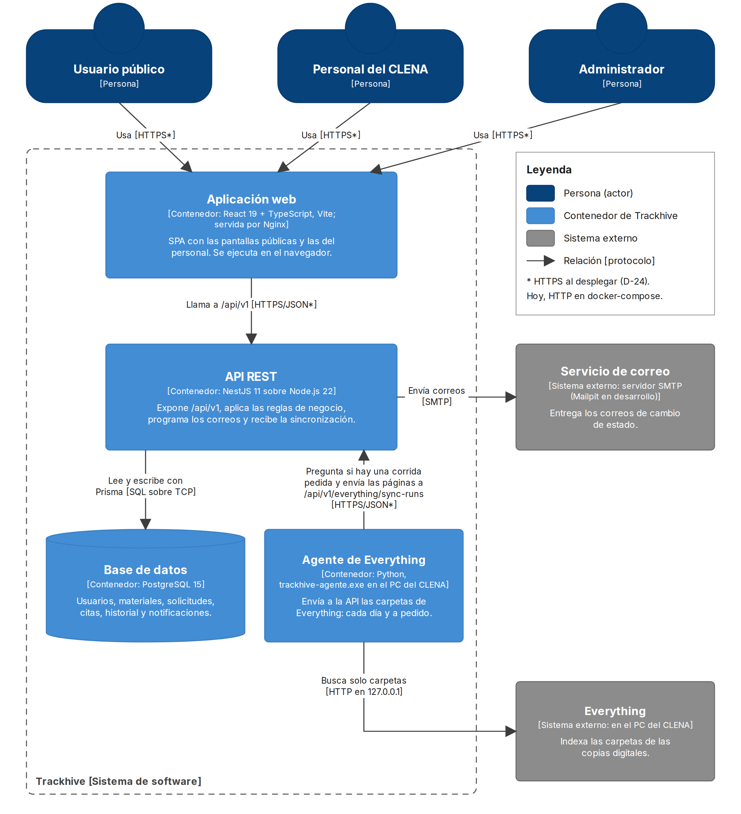
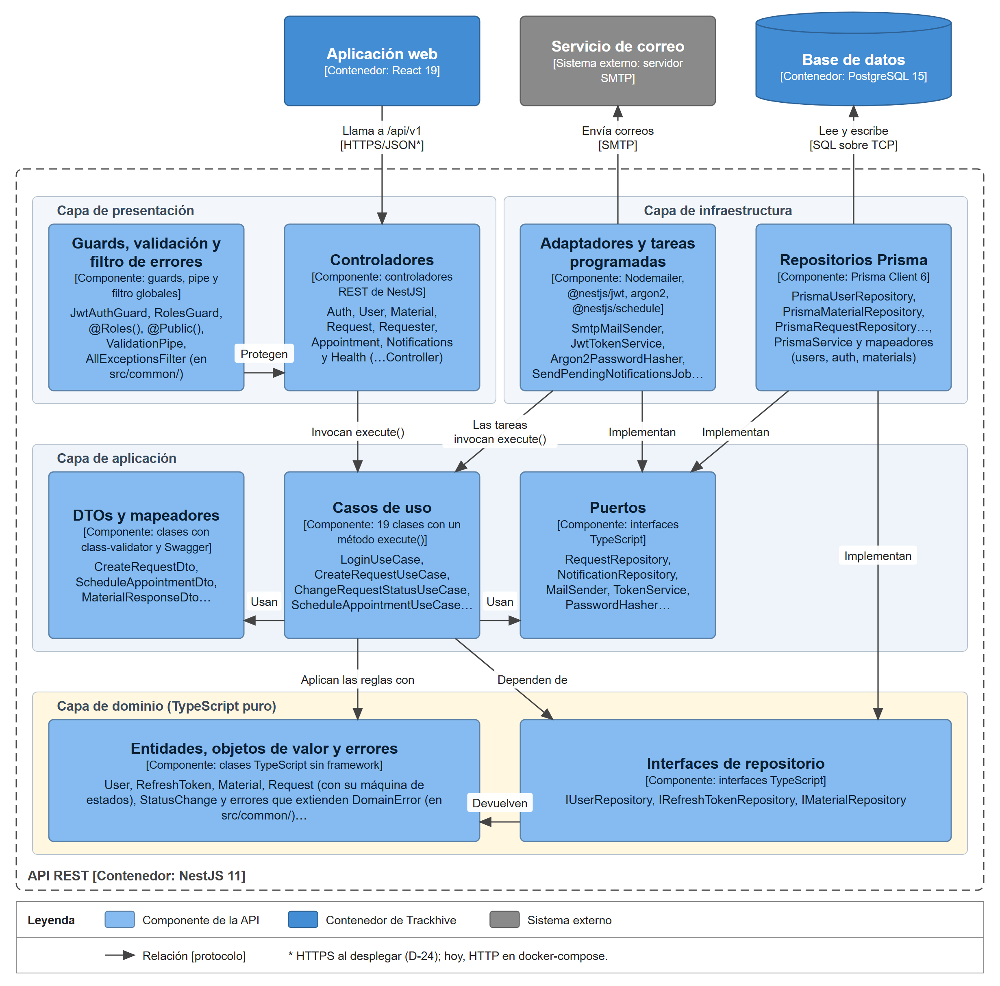

# Arquitectura de Trackhive

> La versión entregable de este documento es `docs/arquitectura.pdf`, con portada, índice y páginas numeradas.

## 1. Introducción

Trackhive es el sistema con el que el CLENA recibe las solicitudes de consulta de su archivo, sigue su estado, controla la disponibilidad del material y agenda las citas de consulta.

Este documento describe su arquitectura con el modelo C4, que muestra el sistema en niveles de detalle creciente:

- **Nivel 1, Contexto:** el sistema, las personas que lo usan y los sistemas externos.
- **Nivel 2, Contenedores:** las aplicaciones y almacenes de datos que forman el sistema, con su tecnología y el protocolo de cada conexión.
- **Nivel 3, Componentes:** las piezas internas de la API y sus dependencias.

El nivel 4 (código) no se dibuja: lo cubren la estructura de carpetas (sección 5) y el fragmento del módulo NestJS (sección 6).

Las figuras son imágenes exportadas a `docs/img/`. Cada una incluye su leyenda, y cada relación lleva una etiqueta con lo que hace y, entre corchetes, el protocolo. Las figuras 1 y 2 se generan con `node docs/tools/generar-c4.mjs` (necesita el Chromium de Playwright del frontend): para cambiarlas se edita ese script y se vuelve a ejecutar.

## 2. Nivel 1: Contexto



**Figura 1.** Diagrama de contexto de Trackhive (C4, nivel 1).

Leyenda: azul oscuro, persona; azul, el sistema Trackhive; gris, sistema externo; flecha, relación con su protocolo entre corchetes; el asterisco indica HTTPS al desplegar (hoy HTTP).

| Elemento | Tipo | Descripción |
|---|---|---|
| Usuario público | Persona (rol `PUBLICO`) | Investigador o ciudadano. Se registra, envía solicitudes de consulta y revisa su estado en «Mis solicitudes». |
| Personal del CLENA | Persona (rol `PERSONAL`) | Atiende la bandeja de solicitudes, busca el material, cambia estados, registra solicitudes a nombre de un solicitante y agenda las citas. |
| Administrador | Persona (rol `ADMIN`) | Tiene los permisos del personal y además puede enviar el correo de prueba que verifica la configuración SMTP, gestionar las cuentas del personal y, en «Sincronización», ver cómo terminó la última sincronización con *Everything* y pedir «Sincronizar ahora» (HU-138). |
| Trackhive | Sistema de software | El sistema que describe este documento. |
| Servicio de correo | Sistema externo | Servidor SMTP que entrega al solicitante los correos de cambio de estado. En desarrollo es Mailpit, que guarda los correos sin enviarlos. |
| *Everything* | Sistema externo | Programa del PC del CLENA que indexa las carpetas de las copias digitales. El agente de Trackhive (HU-166), instalado en ese mismo PC, le pregunta qué carpetas hay y se las envía a Trackhive (D-17). |

## 3. Nivel 2: Contenedores



**Figura 2.** Diagrama de contenedores de Trackhive (C4, nivel 2).

Leyenda: azul oscuro, persona; azul, contenedor de Trackhive; gris, sistema externo; flecha, relación con su protocolo entre corchetes; el asterisco indica HTTPS al desplegar (hoy HTTP).

| Contenedor | Tecnología | Responsabilidad |
|---|---|---|
| Aplicación web | React 19, TypeScript y Vite. En producción la sirve Nginx 1.27 como archivos estáticos. | SPA que se ejecuta en el navegador: pantallas públicas (registro, inicio de sesión, solicitudes) y pantallas del personal (bandeja, materiales, citas). |
| API REST | NestJS 11 sobre Node.js 22 | Expone `/api/v1` y la documentación Swagger en `/docs`. Aplica las reglas de negocio, la autenticación con JWT y la autorización por roles, y programa el envío de correos. |
| Base de datos | PostgreSQL 15 | Guarda usuarios, sesiones, materiales, solicitantes, solicitudes, historial de estados, citas y la tabla de salida de notificaciones. |
| Servicio de correo | Servidor SMTP (externo). Mailpit 1.32 en desarrollo. | Entrega los correos de cambio de estado. |
| Agente de *Everything* | Python 3.13 empaquetado con PyInstaller (`trackhive-agente.exe`). Corre en el PC del CLENA, fuera de los servidores de Trackhive. | Una vez al día consulta *Everything* en ese PC y envía las carpetas de los fondos a los endpoints de ingesta (HU-166, D-17). Mientras el PC está encendido, pregunta cada minuto si un administrador pidió «Sincronizar ahora» y, si lo hizo, sincroniza (HU-138). |

| Conexión | Protocolo | Detalle |
|---|---|---|
| Personas → Aplicación web | HTTPS al desplegar; hoy HTTP | El navegador descarga la SPA. |
| Aplicación web → API REST | HTTPS/JSON al desplegar; hoy HTTP/JSON | Peticiones a `/api/v1` con `Authorization: Bearer <accessToken>`. Nginx reenvía `/api/` y `/docs` a la API. |
| API REST → Base de datos | SQL sobre TCP (puerto 5432) | Consultas de Prisma Client. Las migraciones se aplican con `prisma migrate deploy`. |
| API REST → Servicio de correo | SMTP | Nodemailer, configurado con las variables `SMTP_*`. |
| Agente de *Everything* → API REST | HTTPS/JSON, saliente desde el CLENA | `/api/v1/everything/sync-runs` con `Authorization: Bearer <EVERYTHING_AGENT_TOKEN>`: la pregunta por una corrida pedida (HU-138) y los endpoints de ingesta. Trackhive nunca se conecta al PC del CLENA. |
| Agente de *Everything* → *Everything* | HTTP en `127.0.0.1` | Búsquedas de solo carpetas con usuario y contraseña, en el mismo PC. Nunca por la red. |

Trackhive no almacena archivos. Solo gestiona las solicitudes: las copias digitales del material las entrega el personal del CLENA fuera del sistema, por correo.

**Estado actual de HTTPS:** hoy todas las conexiones del navegador usan HTTP. Nginx solo escucha en el puerto 80 y reenvía a la API con `proxy_pass http://backend:3000`. Las figuras marcan `HTTPS*` porque es el protocolo previsto: el certificado TLS lo pondrá la plataforma de despliegue, que sigue pendiente (D-24).

## 4. Nivel 3: Componentes de la API



**Figura 3.** Diagrama de componentes de la API de Trackhive (C4, nivel 3).

Leyenda: azul claro, componente de la API; azul, contenedor de Trackhive; gris, sistema externo; flecha, dependencia o relación con su protocolo; el asterisco indica HTTPS al desplegar (hoy HTTP). Las franjas son las cuatro capas: presentación e infraestructura arriba, aplicación en medio y dominio abajo, de modo que todas las dependencias bajan hacia el dominio. La fila superior, fuera de la API, reúne lo que se comunica con ella.

**Regla de dependencia:** las dependencias apuntan hacia el dominio. El dominio no importa NestJS, Prisma ni librerías de infraestructura. Infraestructura implementa las interfaces que declaran el dominio y la aplicación.

| Capa | Componentes | Contiene | No puede importar |
|---|---|---|---|
| Presentación | Controladores; guards, interceptores, validación y filtro de errores | Trece controladores bajo `/api/v1`, `JwtAuthGuard` y `RolesGuard` globales, `EverythingAgentGuard` (token del agente de Everything, HU-137) y `AgentContactInterceptor` (último contacto del agente, HU-138), `@Roles()`, `@Public()`, `ValidationPipe` global y `AllExceptionsFilter` global | Repositorios |
| Aplicación | Casos de uso; entradas, DTOs y mapeadores; puertos y servicios | 41 casos de uso con un método `execute` que recibe una interfaz `...Input`, DTOs de petición y de respuesta, mapeadores de respuesta, puertos (`IMailSender`, `ITokenService`, `IPasswordHasher`, `IRequestQueryService`, `ISyncStatusQueryService`, `INotificationQueue`…), servicios (`SessionTokenIssuer`, `RequesterResolver`, `EverythingSynchronizer`, `SyncRunExpirer`) y los tokens de inyección | Prisma, controladores, infraestructura |
| Dominio | Entidades, enumeraciones, objetos de valor, políticas y errores; interfaces de repositorio | `User`, `RefreshToken`, `Material`, `Request` (con su máquina de estados y `Request.create()`), `Requester`, `StatusChange`, errores que extienden `DomainError`, `IUserRepository`, `IRefreshTokenRepository`, `IMaterialRepository`, `IRequestRepository`, `IRequesterRepository` | NestJS, Prisma, librerías externas |
| Infraestructura | Repositorios Prisma; mapeadores de Prisma; adaptadores y tareas programadas | `Prisma…Repository`, `PrismaRequestQueryService`, `PrismaNotificationQueue`, mapeadores de Prisma de cada módulo, `SmtpMailSender`, `JwtTokenService`, `Sha256TokenHasher`, `Argon2PasswordHasher`, `PrismaTrackingCodeGenerator`, `SendPendingNotificationsJob`, `PurgeExpiredTokensJob` | Controladores |

Cuatro precisiones sobre el código actual:

- `src/common/` es una carpeta de código compartido, fuera de las cuatro capas. La figura 3 no la dibuja aparte: muestra `AllExceptionsFilter` en presentación y `DomainError` en dominio, ambos con la nota «en `src/common/`». Contiene `AllExceptionsFilter`, `validationExceptionFactory`, `setupSwagger` y la clase base `DomainError`, que no importa ningún paquete externo. Los errores del dominio la extienden, y esa es la única dependencia del dominio hacia fuera de su capa.
- Las interfaces de repositorio están en `domain/repositories/` y trabajan con entidades (R3 de D-25). Lo que se lee para las pantallas y no es una entidad (listados, detalle, agenda, contexto del correo) está en un puerto de consulta de la aplicación, `IRequestQueryService` (D-25). La cola de correos es el puerto `INotificationQueue`, porque no trabaja con una entidad. En todos los casos la implementación Prisma depende de la interfaz, nunca al revés.
- Los casos de uso usan los decoradores `@Injectable()` e `@Inject()` de NestJS para la inyección de dependencias (D-04). El dominio no importa ningún paquete externo.
- Estas reglas no dependen solo de la revisión: `backend/eslint.config.mjs` y `backend/src/architecture.spec.ts` las verifican en el CI (D-25).

## 5. Estructura de carpetas del backend

El backend se organiza primero por módulo funcional y, dentro de cada módulo, por las cuatro capas. Esta es la estructura real de `backend/`:

```text
backend/
├── prisma/
│   ├── schema.prisma            # modelos de persistencia
│   ├── migrations/              # migraciones SQL versionadas
│   └── seed.ts                  # datos de demostración
├── src/
│   ├── main.ts                  # arranque de la aplicación
│   ├── app.module.ts            # módulo raíz: importa los módulos funcionales
│   ├── app.setup.ts             # prefijo /api/v1, ValidationPipe, filtro y Swagger
│   ├── common/                  # código compartido por todos los módulos
│   │   ├── errors/              # DomainError y formato de error
│   │   ├── filters/             # AllExceptionsFilter
│   │   ├── html/  swagger/  validation/
│   ├── prisma/                  # PrismaModule (global) y PrismaService
│   ├── architecture.spec.ts     # reglas de arquitectura verificadas en el CI (D-25)
│   ├── auth/
│   │   ├── auth.module.ts
│   │   ├── domain/              # entities/  errors/  repositories/
│   │   ├── application/         # use-cases/  dto/  mappers/  ports/  services/  tokens.ts
│   │   ├── infrastructure/      # persistence/  mappers/  security/  jobs/
│   │   └── presentation/        # controllers/  guards/  decorators/
│   ├── users/
│   │   ├── users.module.ts
│   │   ├── domain/              # entities/  enums/  errors/  policies/  repositories/  value-objects/
│   │   ├── application/         # use-cases/  dto/  mappers/  ports/  tokens.ts
│   │   ├── infrastructure/      # persistence/  mappers/  security/
│   │   └── presentation/        # controllers/
│   ├── materials/
│   │   ├── materials.module.ts
│   │   ├── domain/              # entities/  enums/  errors/  repositories/
│   │   ├── application/         # use-cases/  dto/  mappers/  tokens.ts
│   │   ├── infrastructure/      # persistence/  mappers/
│   │   └── presentation/        # controllers/
│   ├── requests/
│   │   ├── requests.module.ts
│   │   ├── domain/              # entities/  enums/  errors/  policies/  repositories/  value-objects/
│   │   ├── application/         # use-cases/  dto/  mappers/  ports/  services/  tokens.ts
│   │   ├── infrastructure/      # persistence/  mappers/
│   │   └── presentation/        # controllers/
│   ├── notifications/
│   │   ├── notifications.module.ts
│   │   ├── domain/              # enums/  errors/  value-objects/
│   │   ├── application/         # use-cases/  dto/  mappers/  ports/  tokens.ts
│   │   ├── infrastructure/      # persistence/  mappers/  mail/  jobs/
│   │   └── presentation/        # controllers/
│   ├── everything/              # sincronización con Everything (E11)
│   │   ├── everything.module.ts
│   │   ├── domain/              # entities/  enums/  errors/  policies/  repositories/  value-objects/
│   │   ├── application/         # use-cases/  dto/  mappers/  services/  tokens.ts  sync-limits.ts
│   │   ├── infrastructure/      # config/  persistence/  mappers/
│   │   └── presentation/        # controllers/  guards/  decorators/  interceptors/
│   └── health/
│       ├── health.module.ts
│       ├── application/         # use-cases/  dto/  mappers/  ports/  tokens.ts
│       ├── infrastructure/      # database/
│       └── presentation/        # controllers/
└── test/                        # pruebas e2e y fakes en memoria
```

Las pruebas unitarias (`*.spec.ts`) están junto al archivo que prueban. En `application/dto/`, los archivos `*.input.ts` y `*.result.ts` son las interfaces planas de entrada y de resultado de los casos de uso; los `*.dto.ts` son las clases con decoradores que valida y documenta la API.

## 6. Módulo NestJS: unión de un caso de uso con su repositorio

El módulo `materials` muestra cómo se cumple la regla de dependencia con la inyección por tokens (D-04).

El token se declara en la capa de aplicación (`materials/application/tokens.ts`):

```ts
export const MATERIAL_REPOSITORY = Symbol('MATERIAL_REPOSITORY');
```

El caso de uso pide la interfaz del dominio, no la clase de Prisma (`materials/application/use-cases/search-materials.use-case.ts`):

```ts
@Injectable()
export class SearchMaterialsUseCase {
  constructor(
    @Inject(MATERIAL_REPOSITORY)
    private readonly materialRepo: IMaterialRepository,
  ) {}
  // ...
}
```

El módulo es el único lugar que conoce la implementación y la enlaza con el token (`materials/materials.module.ts`):

```ts
@Module({
  controllers: [MaterialController],
  providers: [
    {
      provide: MATERIAL_REPOSITORY,
      useClass: PrismaMaterialRepository,
    },
    SearchMaterialsUseCase,
    ChangeMaterialStatusUseCase,
  ],
})
export class MaterialsModule {}
```

Con esto, `SearchMaterialsUseCase` depende solo de `IMaterialRepository`. En las pruebas unitarias se le entrega un repositorio fake en memoria, y cambiar de ORM solo exige otra clase en `useClass`.

## 7. Decisiones técnicas principales

Esta sección justifica las cuatro decisiones que más condicionan el código. Las demás están en las secciones 8 y 9.

### 7.1 ORM: Prisma

- **Decisión:** Prisma 6 (Prisma Client y Prisma Migrate), confinado a la capa de infraestructura.
- **Alternativas:** TypeORM.
- **Justificación:** genera tipos a partir de `schema.prisma` y migraciones SQL versionadas que se revisan en cada PR. Las reglas que el esquema no expresa (`CHECK`, triggers del historial) se escriben a mano en el SQL de la migración.
- **Consecuencias:** las entidades de dominio no son los modelos de Prisma; cada repositorio convierte entre ambos (D-05). El detalle está en D-06.

### 7.2 Validación: class-validator en la API y Zod en el frontend

- **Decisión:** en la API, los DTOs de petición (`application/dto/`) usan decoradores de `class-validator` y `class-transformer`, y un `ValidationPipe` global los aplica con `whitelist`, `forbidNonWhitelisted` y `transform`. Las reglas de negocio se validan en las entidades y los casos de uso. En el frontend, los formularios de registro e inicio de sesión usan React Hook Form con esquemas de Zod. Los demás (nueva solicitud, cambio de estado y agendar cita) manejan su estado con `useState` y validan a mano los campos obligatorios.
- **Alternativas:** validar a mano en cada controlador; usar Zod también en la API.
- **Justificación:** `class-validator` es la opción que NestJS integra de fábrica y comparte los DTOs con Swagger. El pipe global garantiza que ningún endpoint reciba campos no declarados. Separar forma (DTO) de reglas (dominio) mantiene el dominio sin decoradores de framework (D-13).
- **Consecuencias:** los mensajes de validación se devuelven en un formato de error uniforme, armado por `validationExceptionFactory` y `AllExceptionsFilter` (D-14). Una regla de forma puede existir dos veces, en el esquema Zod y en el DTO; la API es la que manda.

### 7.3 Logger: el `Logger` de NestJS

- **Decisión:** se usa el `Logger` que NestJS trae por defecto en `@nestjs/common`, sin configuración propia, con una instancia por clase (`new Logger(Clase.name)`), en el filtro de errores, las tareas programadas, el envío de correo y los casos de uso que cambian estados.
- **Alternativas:** `nestjs-pino`; Winston.
- **Justificación:** es el logger por defecto: no agrega dependencias, marca cada línea con el nombre de la clase y permite niveles (`log`, `warn`, `error`). Para el volumen del CLENA basta con la salida estándar del contenedor, que se consulta con `docker compose logs`.
- **Consecuencias:** hoy los logs salen como texto. El curso pide logs estructurados para la entrega final; la salida en JSON sigue pendiente (D-23). Los mensajes no incluyen datos personales: por ejemplo, un correo fallido se registra con el id de la notificación y el radicado, sin el destinatario.

### 7.4 Librería de componentes del frontend: ninguna, componentes propios con CSS Modules

- **Decisión:** el frontend no usa una librería de componentes. Los componentes son propios (por ejemplo, `TextField` y `AuthLayout`), con estilos en CSS Modules y una hoja global (`src/styles/global.css`). Las fuentes se empaquetan con `@fontsource`.
- **Alternativas:** Material UI; Chakra UI; Tailwind con shadcn/ui.
- **Justificación:** la aplicación tiene pocas pantallas y pocos tipos de control. Con componentes propios el equipo controla el marcado y cumple los criterios de accesibilidad de HU-30 (etiquetas, foco, contraste), que se verifican con `eslint-plugin-jsx-a11y` y pruebas sobre la hoja global. Además, evita el peso y las reglas de estilo de una librería grande.
- **Consecuencias:** cada control nuevo (tablas, diálogos, calendario) se construye y se prueba a mano. La vista de calendario de la agenda también es un componente propio (D-20).

## 8. Resumen de decisiones

La columna «Estado» se revisó contra el código el 11 de noviembre de 2026. «Parcial» indica entre paréntesis lo que falta.

| ID | Decisión | Estado |
|---|---|---|
| D-01 | Clean Architecture con regla de dependencia estricta | Implementada |
| D-02 | Monorepo con `backend/`, `frontend/` y `docs/` | Implementada |
| D-03 | Un caso de uso por clase, con método `execute` | Implementada |
| D-04 | Inyección de dependencias por tokens | Implementada |
| D-05 | Entidades de persistencia separadas de las de dominio, con mapeadores | Implementada |
| D-06 | Prisma como ORM | Implementada |
| D-07 | La máquina de estados vive en la entidad `Request` | Implementada |
| D-08 | Historial de estados en tabla propia, solo de inserción | Implementada |
| D-09 | Sin dobles reservas: un material por día, con índice único en PostgreSQL | Implementada |
| D-10 | Notificaciones por puerto, con tabla de salida y reintentos | Implementada |
| D-11 | JWT (access y refresh) con rotación y contraseñas con argon2 | Implementada |
| D-12 | Autorización por roles con guards globales; propiedad de datos en casos de uso | Implementada |
| D-13 | Validación en dos niveles: forma en presentación, reglas en dominio | Implementada |
| D-14 | Errores de dominio traducidos por un filtro global | Implementada |
| D-15 | API REST versionada con OpenAPI; paginación por página y límite | Implementada |
| D-16 | Búsqueda de material con `pg_trgm`, sin motor de búsqueda externo | Implementada |
| D-17 | Sin integración automática con *Everything* ni lectura de buzón IMAP | Vigente para el buzón IMAP. La integración con *Everything* se hizo en el Sprint 2, con un agente en el PC del CLENA (HU-137, HU-166) y «Sincronizar ahora» (HU-138) |
| D-18 | Fechas en UTC (`timestamptz`) y presentación en `America/Bogota` | Implementada |
| D-19 | Cumplimiento de la Ley 1581: consentimiento versionado y anonimización | Parcial (faltan eliminar la cuenta, HU-33, y la aceptación del solicitante que registra el personal). **Validar con el CLENA** |
| D-20 | Frontend con Vite, React Router y React Hook Form con Zod; sesión con access y refresh token | Implementada |
| D-21 | Pruebas: fakes en memoria para unitarias y PostgreSQL real para e2e | Implementada (HU-41) |
| D-22 | Docker, docker-compose y GitHub Actions | Implementada |
| D-23 | Configuración por entorno validada al arrancar y logs estructurados | Parcial (faltan los logs en JSON) |
| D-24 | Plataforma de despliegue | Parcial (servidores de la universidad; falta el despliegue con HTTPS, HU-42) |
| D-25 | Estructura de Clean Architecture del curso, verificada en el CI | Implementada |
| D-26 | El catálogo solo crece por la sincronización con *Everything*; el material no digitalizado vive como referencia escrita | Implementada (HU-137) |

---

## 9. Decisiones detalladas

### D-01. Clean Architecture con regla de dependencia estricta

- **Decisión:** el backend se organiza en dominio, aplicación, infraestructura y presentación; las dependencias apuntan siempre hacia el dominio.
- **Alternativas:** arquitectura en capas clásica de NestJS (controlador → servicio → repositorio); modular por funcionalidad sin capas explícitas.
- **Justificación:** es un requisito del curso y se evalúa de forma directa. Además aporta valor real: las reglas de estados y de agenda son lo más delicado del sistema y quedan aisladas del framework y de la base de datos, de modo que se prueban sin levantar nada.
- **Consecuencias:** más archivos y más mapeos que en un CRUD directo. A cambio, el CLENA podría cambiar la base de datos o el proveedor de correo sin tocar las reglas de negocio.

### D-02. Monorepo con `backend/`, `frontend/` y `docs/`

- **Decisión:** un único repositorio de GitHub.
- **Alternativas:** dos repositorios independientes.
- **Justificación:** las reglas de evidencia de Scrum se verifican sobre un solo historial de commits, issues y PRs. Un monorepo facilita que un mismo PR cubra backend y frontend de una historia de usuario, y que un único `docker-compose` levante todo.
- **Consecuencias:** el pipeline de CI debe ejecutar tareas distintas por carpeta; se resuelve con jobs separados.

### D-03. Un caso de uso por clase, con método `execute`

- **Decisión:** cada acción de negocio es una clase (`CreateRequestUseCase`, `ScheduleAppointmentUseCase`, `ChangeRequestStatusUseCase`...), con un único método público, `execute`. Los nombres del código van en inglés, que es la convención habitual; los textos que ve el usuario van en español.
- **Alternativas:** servicios grandes agrupados por entidad (por ejemplo, un `RequestsService`).
- **Justificación:** el enunciado pide "casos de uso claros", y las clases pequeñas son fáciles de probar, de revisar en un PR y de asignar entre integrantes sin conflictos.
- **Consecuencias:** muchas clases pequeñas. Se mitiga con una carpeta `application/use-cases/` dentro de cada módulo funcional.

### D-04. Inyección de dependencias por tokens

- **Decisión:** las interfaces de repositorio y los puertos se identifican con tokens (un `Symbol` exportado desde el archivo `application/tokens.ts` de cada módulo). El módulo de NestJS enlaza cada token con su implementación de infraestructura.
- **Alternativas:** inyectar clases concretas; usar clases abstractas como tokens.
- **Justificación:** TypeScript borra las interfaces en tiempo de ejecución, así que se necesita un token para que NestJS pueda resolverlas. Con tokens el caso de uso depende solo de la abstracción, y en las pruebas se inyecta un fake sin tocar el contenedor real.
- **Consecuencias:** el enlace vive en un solo lugar (los módulos). Un token olvidado falla al arrancar, no en producción.

### D-05. Entidades de persistencia separadas de las de dominio, con mapeadores

- **Decisión:** las entidades del ORM viven en infraestructura y nunca salen de ella; los repositorios las convierten a entidades de dominio. En todos los módulos lo hace una clase mapeadora de `infrastructure/mappers/`, en los dos sentidos: de la fila de Prisma a la entidad o al modelo de lectura, y de la entidad o el cambio a los datos que se escriben (`data`). El repositorio solo arma la consulta (`where`, `select`, transacciones) y nunca escribe un objeto `data` a mano (R8 de D-25).
- **Alternativas:** usar una sola clase que sea a la vez entidad de dominio y del ORM.
- **Justificación:** una clase única obligaría al dominio a importar decoradores del ORM, lo que rompe la regla de dependencia (y es motivo de descalificación del criterio de Arquitectura). Separarlas también permite que el modelo de tablas evolucione sin arrastrar a las reglas de negocio.
- **Consecuencias:** código de mapeo adicional que se cubre con pruebas. Es el precio de un dominio puro.

### D-06. Prisma como ORM

- **Decisión:** Prisma con migraciones en SQL versionadas (Prisma Migrate).
- **Alternativas:** TypeORM.
- **Justificación:** es el ORM con el que ya se construyó el módulo base, ofrece buena ayuda de tipos y genera las migraciones a partir de `schema.prisma`. Su esquema no expresa los `CHECK`, el trigger del historial (D-08) ni la extensión `pg_trgm`, pero eso se agrega a mano en el SQL de la migración, creada con `prisma migrate dev --create-only`. Los índices de trigramas (D-16) y el índice único de la agenda (D-09) sí quedan declarados en `schema.prisma`.
- **Consecuencias:** Prisma no tiene `synchronize`; su equivalente es `prisma db push`, que no se usa fuera del desarrollo local (requisito del curso). Fuera de local las migraciones se aplican con `prisma migrate deploy`. Hay que revisar las migraciones generadas antes de fusionarlas. La decisión es reversible porque el ORM queda confinado a infraestructura.

### D-07. La máquina de estados vive en la entidad `Request`

- **Decisión:** las transiciones son las de `docs/modelo-dominio.md` (§4): `RECIBIDA → EN_BUSQUEDA | DISPONIBLE (entrega digital con copia digital, HU-139) | RECHAZADA`; `EN_BUSQUEDA → DISPONIBLE | RECHAZADA`; `DISPONIBLE → AGENDADA (presencial) | ATENDIDA (digital) | CERRADA`; `AGENDADA → ATENDIDA | DISPONIBLE`; `ATENDIDA → CERRADA`. `RECHAZADA` y `CERRADA` son estados finales. Se implementan como métodos de la entidad `Request` (`startSearch()`, `markAvailable()`, `schedule()`, `attend()`, `close()`, `reject(reason)`), que lanzan `InvalidStatusTransitionError` (HTTP 409) ante un cambio no permitido. `markAvailable()` cubre las dos acciones de ese §4 que llegan a `DISPONIBLE` (`marcarDisponible` y `volverADisponible`).
- **Alternativas:** validar las transiciones en el controlador, en el caso de uso o con una tabla de reglas en la base de datos.
- **Justificación:** es la regla de negocio central y no debe poder eludirse desde ninguna otra capa. En el dominio se prueba con pruebas unitarias rápidas y sin infraestructura. Rechazar exige un motivo, y se modela como parámetro obligatorio del método.
- **Consecuencias:** cualquier cambio de estado pasa por la entidad. Las reglas exactas se validan con el equipo de Introducción en la fase de Inception.
- **Implementación (HU-09.2):** `markAvailable(comment)` exige el comentario cuando la solicitud pasa de `EN_BUSQUEDA` a `DISPONIBLE` con referencias escritas sin material asociado (400 `DELIVERY_COMMENT_REQUIRED`); volver de `AGENDADA` a `DISPONIBLE` no lo pide. La condición vive en un solo getter privado (`requiresDeliveryComment`) que también alimenta `commentRequiredFor`, la lista de transiciones permitidas con comentario obligatorio (`RECHAZADA` y, en ese caso, `DISPONIBLE`). `GetRequestDetailUseCase` arma la entidad con sus referencias y devuelve `commentRequiredFor` en el detalle, como `allowedTransitions`, para que el formulario no repita la regla. Cuándo se puede asociar el material de una referencia (`RECIBIDA` o `EN_BUSQUEDA`) lo decide la política `domain/policies/reference-resolution.ts`, que también usan el filtro «por resolver» del listado y el estado que se muestra de cada referencia (`PENDIENTE`, `RESUELTA` o `SIN_MATERIAL`).
- **Implementación (HU-139):** `Request` recibe del repositorio `allMaterialsHaveDigitalCopy` y `anyMaterialNotConsultable`, que arma la política `domain/policies/digital-copy.ts` a partir del `digital_path` y del estado de cada material (sin materiales del catálogo no cuenta como «todos con copia»). `canTransitionTo` permite `RECIBIDA → DISPONIBLE` y deja de permitir `RECIBIDA → EN_BUSQUEDA` cuando la entrega es digital, todos tienen copia, ninguno es `NO_CONSULTABLE` y no hay referencias pendientes; si no, todo sigue como antes. Así `allowedTransitions` (detalle) y `changeStatus` (409 ante una transición que no corresponde) usan la misma regla. `findById` y `findAppointmentById` cargan la copia y el estado de cada material (`REQUEST_ENTITY_ITEMS_SELECT`), y `GetRequestDetailUseCase` arma la entidad con el mismo resumen; el detalle solo expone `hasDigitalCopy`, nunca la ruta. El paso lo confirma el personal con un clic (RN-09) y pasa por `saveStatusChange`, con su fila de historial y su correo (HU-23).

### D-08. Historial de estados en tabla propia, solo de inserción

- **Decisión:** cada transición inserta una fila en `status_history` (estado anterior, nuevo, usuario, fecha, observación). Nunca se actualiza ni se borra.
- **Alternativas:** guardar solo el estado actual; guardar las fechas de cada estado como columnas de `requests`.
- **Justificación:** el requisito de reportes (tiempos de atención) solo es calculable si se conoce cuándo ocurrió cada transición. Además da trazabilidad: se puede responder quién cambió qué y cuándo, algo valioso para un archivo patrimonial.
- **Consecuencias:** la inserción del historial y la actualización de la solicitud ocurren en una misma transacción, coordinada desde el repositorio.
- **Implementación (HU-15):** `PATCH /api/v1/requests/:id/status` (`@Roles('PERSONAL', 'ADMIN')`) llama a `ChangeRequestStatusUseCase`. La entidad `Request.changeStatus()` aplica la transición con los mismos métodos de D-07 y devuelve un `StatusChange` inmutable (estado anterior, nuevo, responsable, fecha y comentario opcional). `PrismaRequestRepository.saveStatusChange()` actualiza la solicitud solo si sigue en el estado anterior (bloqueo optimista; si otra persona la cambió primero responde 409 `REQUEST_STATUS_CONFLICT`), incrementa `version`, llena `attended_at` o `closed_at` cuando corresponde e inserta la fila de `status_history`, todo en una transacción. Un trigger de la migración rechaza `UPDATE`, `DELETE` y `TRUNCATE` sobre la tabla. El historial se muestra en HU-17.
- **Implementación (HU-17):** la primera fila de cada solicitud es su registro: estado anterior `NULL`, `RECIBIDA` y quien la registró. `PrismaRequestRepository.save()` la inserta en el mismo `create` de la solicitud (HU-09 y HU-10, con `PrismaStatusHistoryMapper.toCreationRow()`), así que su fecha es la de `registered_at`. La migración `20261116000000_backfill_status_history_creation` agrega esa fila, con la fecha de registro, a las solicitudes que ya existían; la semilla inserta además la cadena de cambios hasta el estado actual de cada solicitud. `GET /api/v1/requests/:id/history` exige sesión, sin `@Roles()` (HU-04), y llama a `GetRequestHistoryUseCase`, que lee el historial con `IRequestQueryService.findHistory()` (del más antiguo al más reciente) y aplica la política `domain/policies/request-history-access`: PERSONAL y ADMIN ven el historial de cualquier solicitud, con el nombre de quien hizo cada cambio; un usuario PUBLICO solo el de una solicitud cuyo solicitante es su cuenta (si no, 403 `REQUEST_ACCESS_FORBIDDEN`), sin las filas con `visible_to_requester = false` y con «Personal del CLENA» en lugar del nombre del funcionario, para no exponer los datos del personal. No hay ruta para editar ni borrar una fila, y el trigger lo impide en la base. El frontend lo muestra en el detalle de la solicitud (HU-13) y en «Mis solicitudes» (HU-11, botón «Ver historial»).
- **Rechazo con motivo (HU-16):** el mismo endpoint acepta `RECHAZADA`. `changeStatus()` llama a `reject()`, así que el comentario pasa a ser el motivo y es obligatorio: sin él responde 400 `REJECTION_REASON_REQUIRED` y no se guarda nada. El motivo queda en `requests.rejection_reason` (ampliada a `varchar(500)`, con un CHECK que exige que no esté vacío) y como comentario de la fila de `status_history`. `GET /api/v1/requests/mine` lo devuelve para que el solicitante lo vea en «Mis solicitudes».
- **Implementación (HU-09.2):** asociar el material del catálogo a una referencia escrita no cambia el estado, pero queda en el historial con quién lo hizo: una fila `RECIBIDA → RECIBIDA` o `EN_BUSQUEDA → EN_BUSQUEDA`. La migración `20261120120000_create_request_references` amplía el CHECK `status_history_status_changed_check` para admitirlas, junto con `AGENDADA → AGENDADA` de la reprogramación (HU-21). `PrismaRequestRepository.saveReferenceResolution()` guarda en una transacción la referencia resuelta, el material en `request_items` y esa fila, con el mismo bloqueo optimista de `applyStatusChange()`.
- **Implementación (HU-18):** `AGENDADA` ya no se acepta en `PATCH /status`: solo se alcanza con `POST /api/v1/requests/:id/appointments` (`@Roles('PERSONAL', 'ADMIN')`), que llama a `ScheduleAppointmentUseCase`. `Request.scheduleAppointment()` pasa por `schedule()` (solo `DISPONIBLE` y presencial) y devuelve el `StatusChange`. `PrismaRequestRepository.saveAppointment()` guarda, en una transacción, el cambio de estado con el mismo bloqueo optimista, su fila de `status_history` y la cita del día con el solicitante y todos los materiales de la solicitud. La fecha se valida en `toAppointmentDay()`: un domingo responde 400 `INVALID_APPOINTMENT_DATE`. Al salir de `AGENDADA` por «asistió» o «no asistió», la entidad decide el resultado de la cita (`StatusChange.appointmentOutcome`: `CUMPLIDA` o `NO_ASISTIO`) y `saveStatusChange()` solo lo guarda y libera el día de sus materiales. Del mismo modo, `attendedAt`, `closedAt` y el motivo del rechazo salen del `StatusChange`, no del repositorio.

### D-09. Sin dobles reservas de material por día

- **Decisión:** la reserva es por día completo, material y fecha, sin franjas horarias. Mientras la cita está `PROGRAMADA`, `appointment_materials` copia el día en `booked_date`; al cumplirse, registrar inasistencia o cancelarse pasa a `NULL` y el día queda libre. El índice único `(material_id, booked_date)` impide reservar el mismo material dos veces el mismo día — un `NULL` nunca choca, así que solo la cita activa retiene el día. Además, el caso de uso `ScheduleAppointmentUseCase` consulta la disponibilidad antes de insertar: si un material ya tiene cita ese día responde 409 `MATERIAL_ALREADY_BOOKED` nombrando el material, la fecha y el radicado que lo tiene, y si está en restauración o no consultable responde 409 `MATERIAL_NOT_AVAILABLE`; el estado `EN_USO` no bloquea, porque solo aplica al día en que el material está en sala (HU-72). Si la base rechaza la inserción por una carrera (dos funcionarios agendando a la vez), el repositorio traduce la violación del índice a `MaterialAlreadyBookedError`.
- **Alternativas:** solo verificar en el código antes de insertar; franjas horarias con `tstzrange` y una restricción `EXCLUDE` (descartadas: la cita ya no tiene hora, es un día completo, y la igualdad basta sin la extensión `btree_gist`); bloqueos explícitos a nivel de fila.
- **Justificación:** la verificación en código sola es vulnerable a condiciones de carrera. El índice único garantiza la integridad sin importar cuántas instancias de la API corran, y al ser por día no necesita rangos ni extensiones de PostgreSQL. La combinación de verificación previa y restricción es deliberada: la primera da un mensaje claro y la segunda da seguridad.
- **Consecuencias:** la regla vive en una migración SQL y en el dominio (que expresa el concepto), y está documentada en `docs/modelo-dominio.md` (RN-14) y `docs/modelo-datos.md`. `booked_date` se desnormaliza de la cita y se libera en la misma transacción del cambio de estado que saca la solicitud de `AGENDADA` (implementación de HU-20).

### D-10. Notificaciones por puerto, con tabla de salida y reintentos

- **Decisión:** `ChangeRequestStatusUseCase` no envía correos: registra una fila en `notifications` (estado `PENDIENTE`) dentro de la misma transacción del cambio de estado. Un proceso programado (`@nestjs/schedule`) la envía a través del puerto `IMailSender`, implementado con SMTP (Nodemailer), y marca `ENVIADA` o `FALLIDA` con un contador de reintentos.
- **Alternativas:** enviar el correo de forma síncrona dentro del caso de uso; usar una cola externa (Redis, RabbitMQ).
- **Justificación:** una caída del servidor SMTP no debe impedir ni revertir un cambio de estado legítimo. Una tabla de salida da fiabilidad sin sumar infraestructura nueva, algo importante porque el CLENA debe poder operarlo. Una cola externa se descarta por exceso de complejidad para este volumen.
- **Consecuencias:** el correo no es instantáneo (llega en el siguiente ciclo del proceso, de segundos a un par de minutos). En desarrollo se usa Mailpit para inspeccionar correos sin enviarlos. HU-22 implementó el puerto `IMailSender` (`notifications/application/ports/`), su versión SMTP con Nodemailer (`SmtpMailSender`, configurada con las variables `SMTP_*`) y el servicio Mailpit en `docker-compose.yml`. Un administrador puede comprobar la configuración con `POST /api/v1/notifications/test-email`, que le envía un correo de prueba a su propio correo.
- **Implementación (HU-23):** todo cambio de estado pasa por `PrismaRequestRepository.applyStatusChange()`, tanto «Cambiar estado» (`PATCH /requests/:id/status`, HU-15 y HU-16) como «Agendar cita» (`POST /requests/:id/appointments`, HU-18). En la misma transacción que actualiza la solicitud y crea la fila de `status_history`, inserta una fila `PENDIENTE` en `notifications` (migración `20261113000000_create_notifications`), enlazada a esa fila del historial. Antes de guardar, `ChangeRequestStatusUseCase` y `ScheduleAppointmentUseCase` arman el correo con `buildStatusChangeEmail()` (`requests/application/services/`). El correo lleva el radicado, el nuevo estado y el material, y además la fecha y el horario de la cita en `AGENDADA` o el motivo en `RECHAZADA`. Se guarda en texto plano y en HTML, con los datos escritos por personas escapados. Si el solicitante no tiene correo, el cambio se guarda sin notificación y queda un aviso en el log. `SendPendingNotificationsJob` (`@Interval`, cada 10 s) llama a `SendPendingNotificationsUseCase`. El caso de uso reclama hasta 20 correos con bloqueo optimista sobre `attempts`, así que dos ejecuciones o dos instancias no envían el mismo correo, y deja un plazo de 5 minutos para volver a tomar un correo cuyo envío se cortó. Luego los envía por `MailSender` y los marca `ENVIADA`. Si el envío falla, registra en el log el id del correo, el radicado, el intento y el motivo, sin el destinatario (D-23). El motivo queda en `last_error` y el correo se reintenta a los 1, 5, 15 y 60 minutos; al quinto fallo queda `FALLIDA`. El cambio de estado nunca se revierte por un fallo del correo. La entrega es «al menos una vez»: si la base de datos falla justo después de enviar un correo, ese correo puede repetirse. Las plantillas por estado son de HU-24.
- **Implementación (HU-24):** cada estado y evento de cita tiene su propia plantilla en español, con asunto, encabezado y texto adaptados al solicitante: `SOLICITUD_RECIBIDA`, `SOLICITUD_EN_BUSQUEDA`, `SOLICITUD_DISPONIBLE`, `SOLICITUD_AGENDADA`, `SOLICITUD_ATENDIDA`, `SOLICITUD_CERRADA`, `SOLICITUD_RECHAZADA`, `CITA_REPROGRAMADA` y `CITA_CANCELADA`. La migración `20261121000000_add_notification_templates` amplía el CHECK `notifications_template_check` con esos valores y conserva `CAMBIO_ESTADO` por compatibilidad con filas previas de HU-23. La resolución del contenido vive en `requests/application/services/email-templates.ts` (`resolveRequestEmailTemplate()`) y el armado en texto plano y HTML en `requests/application/services/status-change-email.ts` (`buildStatusChangeEmail()`). En `DISPONIBLE` y `ATENDIDA` el texto se adapta al `deliveryMode` (`DIGITAL` frente a `PRESENCIAL`) sin exponer `digitalPath` ni rutas internas del servidor. Cuando el personal ingresa un comentario en un cambio de estado, reprogramación o cancelación, el correo lo incluye bajo «Observaciones del personal» (escapado en HTML y sin duplicar el motivo de rechazo en `RECHAZADA`); si no hay comentario, la sección se omite. `IRequestQueryService.findNotificationContext()` selecciona únicamente `{ catalogCode, title }` de los materiales del catálogo (excluyendo `digitalPath`) y las referencias escritas no resueltas (`status = 'PENDIENTE'`), de modo que los correos listan tanto los materiales asociados como las referencias pendientes sin duplicar las ya resueltas.

### D-11. JWT (access y refresh) con rotación y argon2

- **Decisión:** el access token dura 15 minutos y se firma con `JWT_SECRET`. El refresh token dura 7 días, se firma con `JWT_REFRESH_SECRET` y lleva un `jti` aleatorio para que dos tokens nunca sean iguales. Cada refresh token emitido se guarda en `refresh_tokens` solo como hash SHA-256. `POST /api/v1/auth/refresh` lo rota: revoca el token recibido y entrega un par nuevo. Si llega un token ya revocado (reuso), se revocan todas las sesiones del usuario. `POST /api/v1/auth/logout` revoca el token y responde 204 aunque no exista, como indica el RFC 7009. Las contraseñas se almacenan con argon2. Los tokens viajan en el cuerpo JSON; llevar el refresh token a una cookie `httpOnly` queda como mejora posible (D-20).
- **Alternativas:** sesiones con cookies en servidor; bcrypt; refresh token sin rotación; guardar el refresh token con argon2.
- **Justificación:** JWT con refresh es requisito del curso. La rotación limita el daño de un refresh robado, y guardar solo su hash evita que una filtración de la base entregue sesiones válidas. Para el token basta SHA-256: es largo y aleatorio, así que no se adivina por fuerza bruta como una contraseña, y como el mismo token siempre da el mismo hash, se puede buscar por él. Argon2 usa una sal aleatoria y no permitiría esa búsqueda. Para las contraseñas sí se usa argon2, que resiste mejor ataques por GPU que bcrypt.
- **Consecuencias:** el access token no se puede revocar: sigue sirviendo hasta 15 minutos después de cerrar sesión, y por eso dura poco. La tabla no guarda una familia de tokens, así que ante un reuso se cierran todas las sesiones del usuario y no solo la cadena afectada. Si el frontend lanza dos renovaciones a la vez con el mismo token, la segunda cuenta como reuso, así que debe esperar a que termine la primera. Cada inicio de sesión y cada renovación agregan una fila. Por eso una tarea diaria (`@nestjs/schedule`, a las 3:00 hora de Bogotá, y una vez al arrancar la app) borra las filas vencidas. Las revocadas que aún no vencen se conservan, porque sirven para detectar el reuso (HU-3.1).

### D-12. Autorización por roles con guards globales; propiedad en casos de uso

- **Decisión:** `JwtAuthGuard` y `RolesGuard` se registran como guards globales; los endpoints declaran sus roles con `@Roles()` y los públicos con `@Public()`. Reglas como "un usuario público solo ve sus propias solicitudes" se implementan en el caso de uso, que recibe el identificador del usuario.
- **Alternativas:** aplicar guards endpoint por endpoint; resolver la propiedad en el guard.
- **Justificación:** con guards globales ningún endpoint queda desprotegido por olvido. La propiedad de los datos es una regla de negocio, así que no corresponde a presentación.
- **Implementación:** `JwtAuthGuard` valida el `Authorization: Bearer <accessToken>` y deja `{ id, role }` en `request.user`; sin token, o con uno inválido o vencido, responde 401. `RolesGuard` compara ese rol con los de `@Roles()` y responde 403 si no coincide. Ambos están en `backend/src/auth/presentation/`.
- **Consecuencias:** los endpoints sin `@Roles()` exigen al menos autenticación; solo `@Public()` los abre.
- **Implementación (HU-05):** la gestión de las cuentas del personal está en `StaffUserController` (`/api/v1/users/staff`), que declara `@Roles('ADMIN')` en la clase: `GET` lista, `POST` crea y `PATCH /:id` edita, desactiva o reactiva. `PERSONAL` y `PUBLICO` reciben 403 en los tres. Las reglas están en la entidad `User`. Por decisión del equipo, el administrador solo crea cuentas `PERSONAL` y ninguna cuenta pasa de `PERSONAL` a `ADMIN`; la cuenta `ADMIN` es la de la semilla. `User.createStaff()` no recibe rol: siempre crea una cuenta `PERSONAL` activa, con la contraseña inicial que define el administrador guardada con argon2 y sin consentimiento de privacidad, que es del registro público (D-19). `user.updateStaffAccount(cambios, quién)` cambia nombres, correo y `active`, nunca el rol. Los DTOs de `POST` y `PATCH` no declaran `role`, así que el `ValidationPipe` rechaza ese campo con 400 (D-13). El administrador no puede desactivar su propia cuenta (409 `CANNOT_CHANGE_OWN_ACCESS`). Una cuenta pública no se gestiona aquí: su id responde 404 `STAFF_USER_NOT_FOUND`. Desactivar no borra nada: la cuenta conserva sus solicitudes y su historial, `LoginUseCase` la rechaza (401 `INVALID_CREDENTIALS`, el mismo error de una contraseña incorrecta) y `RefreshSessionUseCase` no le renueva la sesión. El access token que ya tenía sigue sirviendo hasta que vence, como máximo 15 minutos (D-11). El listado usa `IUserRepository.search()`: busca cada palabra en los cuatro campos del nombre o en el correo y filtra por rol y estado. Ordena por apellido, nombre, correo, rol o fecha de creación, y pagina con `page` y `limit` (D-15). En el frontend, `/admin/usuarios` está dentro de `AdminRoute` y el menú muestra «Usuarios» solo a `ADMIN`.

### D-13. Validación en dos niveles

- **Decisión:** los DTOs de petición (clases con `class-validator` en `application/dto/`) validan forma y tipos. Los aplica en la frontera de presentación un `ValidationPipe` global, con `whitelist` y `forbidNonWhitelisted` activos. Las reglas de negocio (transiciones, fechas coherentes, disponibilidad) se validan en dominio y aplicación.
- **Alternativas:** validar todo en los DTOs; validar todo en el dominio.
- **Justificación:** los decoradores de validación son dependencias de framework, así que no pueden estar en el dominio. Cada nivel responde a una pregunta distinta: "¿la petición está bien formada?" y "¿la operación está permitida?".
- **Consecuencias:** los DTOs viven en la capa de aplicación y llevan decoradores de `class-validator` y de Swagger, así que esa capa depende de esas dos librerías; el dominio no. Cada caso de uso recibe además su propia entrada sin decoradores, una interfaz `...Input` en `application/dto/*.input.ts` (por ejemplo, `SearchMaterialsInput`). El controlador le pasa el DTO ya validado junto con los datos de quien llama (`userId`, `viewerRole`), que van dentro de la entrada. Así el caso de uso no conoce la petición HTTP (D-25, D-B).

### D-14. Errores de dominio traducidos por un filtro global

- **Decisión:** el dominio y la aplicación lanzan excepciones propias (`InvalidStatusTransitionError`, `MaterialAlreadyBookedError`, `RequestNotFoundError`...). Un filtro global (`AllExceptionsFilter`, en `src/common/filters/`) las traduce a códigos HTTP y a un formato de error uniforme con un `code` estable.
- **Alternativas:** lanzar `HttpException` desde los casos de uso.
- **Justificación:** las `HttpException` pertenecen a NestJS y contaminarían el núcleo. Un `code` estable permite al frontend reaccionar por tipo de error sin depender del texto del mensaje.
- **Consecuencias:** cada error nuevo requiere una línea en el mapeo; un error sin mapear devuelve 500 y se registra en logs.
- **Criterio para los errores de validación del dominio:** los errores que dicen que un dato no es válido (`INVALID_MATERIAL_TYPE`, `INVALID_MATERIAL_STATUS`, `INVALID_NAME`…) responden 400, aunque hoy algunos solo puedan salir de una fila ya guardada. La entidad los lanza igual al crearse desde una petición (por ejemplo, al cambiar el estado de un material en HU-08 con un estado que no existe), y ahí el error es del cliente. Un dato corrupto en la base es un caso excepcional que se investiga con el log del filtro.

### D-15. API REST versionada con OpenAPI

- **Decisión:** prefijo `/api/v1` con versionado por URI; documentación Swagger en `/docs`; listados con paginación por `page` y `limit`, filtros y ordenamiento.
- **Alternativas:** GraphQL; paginación por cursor.
- **Justificación:** REST con OpenAPI es requisito. La paginación por página es suficiente para el volumen esperado y es más sencilla para una tabla de bandeja con saltos de página. La especificación OpenAPI permite generar el cliente del frontend y evita desajustes de tipos.
- **Consecuencias:** si el volumen crece mucho, habrá que migrar a paginación por cursor; no es una necesidad actual.

### D-16. Búsqueda de material con `pg_trgm`

- **Decisión:** la búsqueda es por coincidencia parcial, sin distinguir mayúsculas de minúsculas (`ILIKE '%texto%'`, que Prisma genera con `contains` y `mode: 'insensitive'`). Para que no recorra toda la tabla hay índices GIN con `pg_trgm` sobre el título, el autor y la colección del material y sobre los cuatro campos del nombre del solicitante.
- **Alternativas:** `LIKE` sin índice; Elasticsearch o similar.
- **Justificación:** el personal busca con un fragmento del título, del autor o del nombre, no con el texto exacto. Un índice B-tree normal no sirve cuando el texto buscado puede estar en medio de la columna; un índice de trigramas sí. Así la búsqueda queda dentro de PostgreSQL, sin un servicio extra que el CLENA tendría que operar. Un motor de búsqueda dedicado es desproporcionado para este volumen.
- **Consecuencias:** requiere la extensión `pg_trgm`, que se habilita en la migración que crea `materials`. La búsqueda no corrige errores de escritura: «Garcia» no encuentra «García» ni «Garsia». `pg_trgm` permite agregarlo después con `similarity()` sobre los mismos índices. El código de catálogo, el correo y el documento del solicitante también se buscan por coincidencia parcial, pero sin índice de trigramas. La búsqueda dentro del contenido de los documentos queda fuera de alcance (ver D-17).

### D-17. Sin integración automática con *Everything* ni lectura de buzón IMAP

- **Decisión:** el personal busca en *Everything* como hoy y registra el resultado (disponibilidad) en Trackhive. Las solicitudes entran por un formulario web público o las registra el personal; no se lee el buzón `labdigital@clena.org` de forma automática.
- **Alternativas:** integrar con *Everything*; procesar correos entrantes por IMAP.
- **Justificación:** la integración con *Everything* es técnicamente posible: el programa incluye un servidor HTTP opcional que responde las búsquedas en JSON (`?search=...&json=1`). No se hace ahora por tres razones. El alcance acordado con el CLENA es que Trackhive solo gestiona las solicitudes, y el enunciado no la exige. La API tendría que alcanzar por red el equipo Windows donde corre *Everything*, y eso depende de la plataforma de despliegue (D-24). Y ese servidor expone los nombres y rutas de los archivos del CLENA, así que habría que activarlo y protegerlo con usuario y contraseña. Leer el buzón añade riesgo (credenciales institucionales, correos con formato libre, datos personales no controlados) para un beneficio que el formulario público ya cubre.
- **Consecuencias:** la integración con *Everything* se documenta como mejora futura: Trackhive podría consultarlo para saber qué material tiene copia digital. Antes hay que validarlo con el CLENA. El formulario web es la vía que reduce la lectura manual de correos que describió el personal.
- **Sprint 2 (épica E11):** la integración con *Everything* se retoma para registrar las copias digitales. El entorno para desarrollarla sin el equipo del CLENA (documentos simulados, Everything portable, fixtures reales y mock) está en [everything-desarrollo.md](everything-desarrollo.md) (HU-133).
- **Conexión con el CLENA (decisión del 2026-11-20, HU-166):** Trackhive se aloja en servidores de la universidad (D-24) y el CLENA no pertenece a ella, así que solo se comunican por internet. *Everything* solo responde peticiones: no puede enviar resultados a una URL. El PC del CLENA está detrás de su router, con IP privada y sin IP pública, así que el servidor no puede iniciar la conexión hacia él. Abrir un puerto se descartó: el servidor HTTP de *Everything* no cifra y no es un servidor endurecido. Por eso un **agente** instalado en ese PC invierte la conexión: consulta *Everything* en `localhost` y solo hace conexiones salientes por HTTPS hacia Trackhive.
  - **Alternativa descartada:** un túnel inverso (Cloudflare Tunnel con Access), con el que el backend consultaría *Everything* directamente. Depende de un servicio y un dominio externos, y si el PC está apagado a la hora de la consulta, ese día no se sincroniza.
  - **Implementación (HU-166):** `agent/`, en Python, con las mismas capas que el backend (dominio, aplicación, infraestructura y presentación; una prueba verifica la regla de dependencia, como D-25). PyInstaller lo empaqueta como un único `trackhive-agente.exe`, que el CI construye y prueba en `windows-latest`: el PC no necesita nada instalado. Lee `agente.toml`: la URL, el usuario y la contraseña de *Everything* en `localhost`, las raíces, la URL de Trackhive y el token. En el repositorio solo va el ejemplo. Se niega a arrancar con una URL `http://` que no sea `localhost`, verifica el certificado con el almacén de Windows (`truststore`) y no sigue redirecciones, para no entregar el token a otro servidor. Pide solo carpetas bajo cada raíz (`folder:` + ruta) en páginas de 200, con `offset` y `count`, numeradas desde 1 en toda la corrida, y envía cada página sin transformarla. Cierra la corrida completa solo si llegaron todas. Como el backend marca como no encontrada toda copia que la corrida no vio, de cualquier raíz, la corrida también falla si una raíz vuelve sin carpetas (unidad de red desconectada, índice a medio cargar, errata en la configuración) o si su número de carpetas cambia entre páginas mientras se lee con `offset`. Si *Everything* no responde o pasa el tiempo de espera, la cierra con error y lo deja en su log, así que no se marca nada como no encontrado. Las peticiones a Trackhive se reintentan con espera creciente; si no lo logra, la siguiente ejecución vuelve a intentarlo. Corre una vez al día con el Programador de tareas de Windows, con «ejecutar la tarea lo antes posible si se omitió un inicio programado»: si el PC estaba apagado, sincroniza al encenderlo. Instalación y operación en [manual-operacion.md](manual-operacion.md), sección 10.
- **Implementación (HU-138):** «Sincronizar ahora» no hace que el servidor llame al PC del CLENA, porque no puede. El administrador deja una corrida pedida y el agente la toma la próxima vez que pregunta. `POST /api/v1/everything/sync-requests` (`@Roles('ADMIN')`) crea en `sync_runs` una corrida `PEDIDA`, con quién y cuándo la pidió y sin inicio (`started_at` NULL). El agente pregunta con su token `GET /api/v1/everything/sync-runs/requested`. Cuando inicia la sincronización (`POST /everything/sync-runs`), esa misma corrida pasa a `EN_CURSO` y sigue como cualquier otra, así que también la toma la corrida diaria. Una corrida pedida no vence: si el PC está apagado, sigue pedida hasta que se encienda. El índice único parcial `sync_runs_single_open_idx` (sobre `PEDIDA` y `EN_CURSO`, en lugar del de HU-137) impide que haya dos a la vez. Pedir otra responde 409 `SYNC_RUN_ALREADY_REQUESTED` o `SYNC_RUN_ALREADY_RUNNING`. Si la corrida en curso venció (el agente la abandonó), primero se cierra con error sin marcar nada, como al iniciar otra. Sin `EVERYTHING_AGENT_TOKEN` la petición responde 503. `GET /api/v1/everything/sync-status` (`@Roles('ADMIN')`) arma la pantalla `/admin/sincronizacion` (WF-14) con el puerto de consulta `ISyncStatusQueryService`, que lee todo en un mismo instante (D-25). Muestra si la integración está activa, la corrida pedida o en curso, la última que terminó (cuándo, cuántas carpetas, OK o ERROR y el motivo) y la última vez que el agente llamó con su token. Ese momento es la entidad `SyncAgent`, que `AgentContactInterceptor` guarda en la tabla de una sola fila `sync_agent` en cada llamada que pasa `EverythingAgentGuard`. En el PC del CLENA, una segunda tarea programada inicia el agente con `--vigilar` al iniciar sesión, y este pregunta cada `trackhive.poll_seconds` (60 s). El `.exe` de PyInstaller es un lanzador con el agente como proceso hijo, así que el hijo espera sobre el lanzador y termina con él cuando Windows detiene la tarea. La pantalla se actualiza sola cada 5 s mientras hay una corrida pedida o en curso. Detalle en [everything-desarrollo.md](everything-desarrollo.md), sección 7.
- **Implementación (HU-137):** el backend no consulta Everything. El agente del CLENA (HU-166) llama a tres endpoints de ingesta (`/api/v1/everything/sync-runs`): iniciar corrida, enviar página y cerrar corrida. Están protegidos con `EVERYTHING_AGENT_TOKEN` por `EverythingAgentGuard`, un guard propio separado del inicio de sesión que compara en tiempo constante; sin el token responden 401, y si el token no está configurado, 503. El controlador es delgado: cada endpoint llama a una operación de `EverythingSynchronizer` (`application/services/`). Una página se valida (HU-135; 413 por encima de 500 resultados o 100 kB) y se guarda en su transacción en `sync_run_pages`. El parseo (HU-136) necesita todas las carpetas a la vez, porque Everything ordena por nombre y mezcla niveles entre páginas. Por eso, al cerrar la corrida completa (con las páginas 1..N), se parsea todo y se hace el *upsert* página por página, cada una en su transacción, por código de catalogación. Después se marcan como «copia digital no encontrada» (`digital_path = NULL`) los materiales de Everything que no aparecieron, sin borrar ninguno. Una corrida con error, cortada o vencida (`EVERYTHING_RUN_TIMEOUT_MINUTES`) no marca nada. El índice único parcial de `sync_runs` impide dos corridas a la vez (409). Detalle en [everything-desarrollo.md](everything-desarrollo.md), sección 7.

### D-18. Fechas en UTC y presentación en `America/Bogota`

- **Decisión:** todas las columnas de fecha y hora son `timestamptz` y se almacenan en UTC; la API devuelve ISO 8601 y el frontend las muestra en `America/Bogota`. Las reglas que dependen de la hora la reciben como parámetro opcional (`now: Date = new Date()`), por ejemplo en `Request.changeStatus()`, `Material.changeStatus()` y `todayInBogota()`.
- **Alternativas:** guardar hora local sin zona; un puerto de reloj (`RelojPort`) inyectado en cada caso de uso.
- **Justificación:** evita errores en reportes y citas ante cambios de servidor o despliegue. El parámetro `now` permite probar con una hora fija las reglas que dependen del tiempo, sin sumar un puerto ni un proveedor más al módulo.
- **Consecuencias:** el frontend es responsable de la conversión; las fechas "solo día" (fecha deseada) se tratan como tipo `date`.

### D-19. Cumplimiento de la Ley 1581: consentimiento y anonimización *(validar con el CLENA)*

- **Decisión:** se recogen solo los datos mínimos necesarios; el formulario de registro exige aceptar el aviso de privacidad, y la aceptación se guarda en `users` con fecha y versión del texto. La tabla `requesters` tiene las mismas columnas para el solicitante. La eliminación de cuenta anonimiza los datos personales del solicitante (nombre, correo, teléfono) y conserva las solicitudes y el historial sin datos personales, para no romper los reportes.
- **Alternativas:** borrado físico en cascada.
- **Justificación:** el borrado en cascada destruiría el historial y los indicadores de atención, y sería incompatible con la trazabilidad de un archivo. La anonimización cumple con la supresión del dato personal sin perder la información agregada.
- **Consecuencias:** el equipo debe confirmar con el CLENA si existen obligaciones de conservación que exijan otro tratamiento. No se usan datos reales sin autorización escrita; las semillas son ficticias.
- **Estado actual:** están implementados el aviso de privacidad y el consentimiento versionado al registrarse (HU-31). En `requesters`, la fecha y la versión las escribe el sistema al crear el solicitante: quien tiene cuenta ya aceptó el aviso al registrarse, pero cuando el personal registra a alguien sin cuenta todavía no se recoge su aceptación. Falta también la eliminación de cuenta con anonimización (HU-33), que el curso exige para la entrega final.

### D-20. Frontend: Vite, React Router y React Hook Form con Zod; sesión con access y refresh token

- **Decisión:** React con TypeScript sobre Vite. React Hook Form con esquemas de Zod en los formularios de registro e inicio de sesión; los demás formularios usan `useState` (sección 7.2). React Router con rutas protegidas por rol (`ProtectedRoute`, `StaffRoute`). Las llamadas a la API usan `fetch` con una función propia, `authenticatedFetch`, que agrega el access token y, si la API responde 401, renueva la sesión con el refresh token y repite la petición. La vista de calendario de la agenda es un componente propio (`AppointmentsCalendarPage`). Los dos tokens se guardan en `sessionStorage`.
- **Alternativas:** React Query para los datos del servidor; FullCalendar para la agenda; Redux para el estado; guardar los tokens en `localStorage` o llevar el refresh token a una cookie `httpOnly`.
- **Justificación:** la aplicación tiene pocas pantallas y cada una pide sus datos al entrar, así que una función sobre `fetch` basta y evita dependencias. El calendario solo muestra las citas por día, sin franjas horarias (D-09), y por eso no necesita una librería de calendario. `sessionStorage` se borra al cerrar la pestaña, a diferencia de `localStorage`.
- **Consecuencias:** no hay caché de datos entre pantallas: cada pantalla vuelve a consultar la API. `sessionStorage` es legible por JavaScript, así que un ataque XSS podría leer los tokens; lo limitan la corta vida del access token y la rotación del refresh token (D-11). Pasar el refresh token a una cookie `httpOnly` queda como mejora posible: solo cambiaría la capa de presentación de `auth` y la configuración de CORS. La accesibilidad (contraste, etiquetas, teclado, textos escalables) se trata como criterio de revisión en cada PR.

### D-21. Pruebas: fakes en memoria para unitarias y PostgreSQL real para e2e

- **Decisión:** las pruebas unitarias del dominio y de los casos de uso usan repositorios fake en memoria. Las pruebas e2e de la API se ejecutan contra un PostgreSQL real (servicio en GitHub Actions y en docker-compose), con migraciones aplicadas.
- **Alternativas:** mocks de librería en todas partes; SQLite en memoria para e2e.
- **Justificación:** los fakes aprovechan que los casos de uso dependen solo de interfaces y mantienen las pruebas rápidas y legibles. Las e2e necesitan PostgreSQL real para aplicar las mismas migraciones de producción: el índice único de la agenda (D-09) y `pg_trgm` (D-16), que SQLite no soporta.
- **Consecuencias:** el CI es algo más lento.
- **Estado actual (HU-41):** las pruebas unitarias usan fakes en memoria. Las e2e de los flujos principales (`backend/test/flows/`: registro e inicio de sesión, radicar solicitud HU-09, cambio de estado HU-15 y agendar cita HU-18) corren contra PostgreSQL con los repositorios reales y revisan las filas guardadas: historial, bandeja de salida de correos y reserva del material por día. Solo se reemplaza lo que sale del sistema: el servidor de correo (`FakeMailSender`). El job de envío de correos se desactiva en esas pruebas para que un archivo no envíe los correos de otro. Las demás e2e (`backend/test/*.e2e-spec.ts`) siguen con fakes en memoria: prueban validaciones, roles y formato de errores sin depender de la base.
  - **Base aislada:** `test/setup/global-setup.ts` borra la base y le aplica las migraciones (`prisma migrate reset`) una vez por corrida. `test/setup/use-e2e-database.ts` apunta `DATABASE_URL` de cada worker a esa base. La URL sale de `E2E_DATABASE_URL` (el CI la define, con un servicio `postgres:15-alpine` propio del job) o, si no está, de `DATABASE_URL` con el sufijo `_e2e` en el nombre de la base. Si el nombre final no termina en `_e2e`, las pruebas se detienen antes de tocar nada. Cada prueba crea sus propios usuarios y materiales con identificadores únicos, así que los archivos pueden correr en paralelo sobre la misma base.
  - **Everything:** el backend no llama a Everything, así que no hay nada que reemplazar con un fake: el agente (HU-166) le envía las páginas tal como las devuelve Everything y las e2e de la sincronización (HU-137) envían las de `dev/fixtures/`. `EverythingPageMapper` (`src/everything/application/mappers/`, HU-135) las traduce a `DocumentRecord`; sus pruebas unitarias usan esos fixtures reales, y las del parseo, `dev/manifiesto.json` (HU-133, [guía](everything-desarrollo.md)). El caso **Recibida** → **Disponible** con copia digital se prueba en HU-139.
  - **Con un agente de IA:** Prisma bloquea `migrate reset` cuando lo lanza un agente (por ejemplo, Claude Code) y le pide el consentimiento explícito del usuario. En el CI y en una terminal normal no aplica.
- **Cobertura mínima (HU-40):** `pnpm test:cov` mide solo `domain/` y `application/`, que es donde viven las reglas de negocio. Se excluyen los `*-response.dto.ts`: solo describen la respuesta para Swagger y no tienen lógica. Los DTOs de entrada sí se miden, porque validan. El umbral es 70 % en statements, branches, functions y lines. Jest lo exige sobre el total y `scripts/coverage-report.mjs` lo exige en cada capa por separado, para que el dominio no tape una aplicación con pocas pruebas. En cada PR, el CI publica la tabla por capa y por feature en el resumen del job y sube el reporte HTML como artefacto `backend-coverage`.

### D-22. Docker, docker-compose y GitHub Actions

- **Decisión:** `docker-compose up` levanta backend, frontend y PostgreSQL sin pasos manuales (aplica migraciones y semillas de demostración). Cada Pull Request ejecuta lint, pruebas unitarias con cobertura mínima del 70 % en dominio y aplicación (D-21), e2e y build en GitHub Actions; `main` queda protegida y requiere CI en verde y una aprobación.
- **Alternativas:** instalación manual en el servidor del CLENA.
- **Justificación:** es requisito y, además, es lo que permite que el CLENA opere el sistema sin el equipo. Un despliegue reproducible reduce el riesgo de que "funcione solo en una máquina".
- **Consecuencias:** `docs/manual-operacion.md` debe cubrir variables de entorno, despliegue y respaldo de la base de datos.

### D-23. Configuración por entorno y logs estructurados

- **Decisión:** `@nestjs/config` con validación de las variables al arrancar (la aplicación falla si falta alguna); `.env.example` en el repositorio y ningún secreto en el código. Logs en formato JSON y endpoint `GET /api/v1/health`.
- **Alternativas:** leer `process.env` directamente; logs de texto libre.
- **Justificación:** fallar pronto ante una configuración incompleta evita errores difíciles de rastrear en producción. Los logs estructurados se pueden filtrar y consultar, y `/api/v1/health` permite monitoreo y verificaciones del despliegue.
- **Consecuencias:** hay que evitar registrar datos personales en los logs.
- **Estado actual:** existen `.env.example` y `GET /api/v1/health`, y no hay secretos en el código. Los logs salen como texto con el `Logger` de NestJS (sección 7.3); pasarlos a JSON está pendiente y el curso lo exige para la entrega final. Validar las variables al arrancar es una meta del equipo; hoy `docker-compose` ya se niega a levantar si falta una variable.

### D-24. Plataforma de despliegue *(parcial)*

- **Decisión (2026-11-20):** Trackhive se aloja en servidores de la universidad. El servidor, el dominio, el certificado TLS y el despliegue se completan en HU-42.
- **Opciones evaluadas:** un servicio gestionado con contenedores (Render, Railway, Fly.io) o un VPS con docker-compose.
- **Criterios:** costo (idealmente gratuito o muy bajo para la demo), soporte de PostgreSQL 15+, URL pública estable y facilidad para que el CLENA lo mantenga.
- **Consecuencias:** debe resolverse antes del Sprint 3. Cualquier opción debe poder reproducirse a partir del `docker-compose` del repositorio.
- **Requisitos del agente de *Everything* (HU-166):** el CLENA no pertenece a la universidad y su PC no tiene IP pública, así que la sincronización depende de que el agente llegue a Trackhive desde internet (D-17):
  - Los endpoints de ingesta (`/api/v1/everything/sync-runs`, a través del nginx del frontend) se publican por HTTPS con un certificado válido. El agente se niega a usar `http://` y verifica el certificado.
  - El cierre de una corrida actualiza todo el catálogo, así que el tiempo de espera del proxy (`proxy_read_timeout` de nginx, 60 s por defecto) debe alcanzar para ese endpoint.
  - El servidor nunca se conecta al PC del CLENA: allí no se abre ningún puerto.
  - Al desplegar, `base` de `backend/config/catalog-convention.json` deja de ser `C:\trackhive\docs_simulados` y pasa a ser la unidad o la ruta de red que informa *Everything* en el CLENA (`Z:\` o `\\<servidor>\Multimedia`). Las raíces de `agente.toml` usan esa misma ruta.

### D-25. Estructura de Clean Architecture del curso, verificada en el CI

- **Decisión:** el backend sigue la estructura de Clean Architecture del curso («Clean Architecture con NestJS, Prisma y Docker») y la verifica en el CI (#144). Las reglas que se adoptan del curso son:
  - **R1.** El dominio no importa NestJS, Prisma ni Swagger.
  - **R2.** El dominio solo tiene subcarpetas: `entities/`, `errors/`, `repositories/` y `enums/`.
  - **R3.** Las interfaces de repositorio están en `domain/repositories/` y reciben y devuelven entidades.
  - **R4.** Los puertos de servicios externos están en `application/ports/`.
  - **R5.** `application/dto/` guarda los contratos de entrada y salida; los DTOs llevan `class-validator` y Swagger.
  - **R6.** Las respuestas se arman con mapeadores de `application/mappers/`.
  - **R7.** El caso de uso orquesta y no conoce HTTP.
  - **R8.** El mapeo entre Prisma y el dominio está en `infrastructure/mappers/`.
  - **R9.** Las interfaces de contrato llevan el prefijo `I`.
  - **R10.** Inyección por tokens, con `@Injectable()` e `@Inject()` en los casos de uso.
- **Diferencias propias del equipo con el curso:**
  - **D-A.** Hay una capa `presentation/` aparte. En el curso, los controladores, guards y decoradores van en `infrastructure/`; aquí se separan porque se entiende mejor qué entra por HTTP y qué sale hacia la base o el correo.
  - **D-B.** Todo caso de uso recibe exactamente una interfaz `...Input` (o ninguna), aunque sea un solo dato. Los datos de quien llama van dentro de ella. El curso pasa datos sueltos, pero aquí hay entradas de 6 a 8 campos.
  - **D-C.** Un caso de uso no define tipos ni funciones en su archivo. Los tipos están en `application/dto/` y el mapeo en `application/mappers/`.
  - **D-D.** Lo que se lee y no es una entidad (listados, detalle, agenda, contexto del correo, conflictos de agenda) está en un puerto de consulta de la aplicación (`IRequestQueryService`), no en el repositorio del dominio.
  - **D-E.** El dominio suma dos subcarpetas al curso: `value-objects/` (valores con sus reglas y registros inmutables, como `DesiredDate` o `StatusChange`) y `policies/` (reglas de negocio que no son de una sola entidad, como la disponibilidad del material `material-availability`, la capacidad diaria de la sala `room-capacity` o las salvaguardas sobre préstamos de una cita `appointment-loans`). Los casos de uso (`CancelAppointmentUseCase`, `RescheduleAppointmentUseCase`, `ChangeRequestStatusUseCase`) consultan primero el conteo de préstamos en `IRequestQueryService` y aplican `domain/policies/appointment-loans` antes de invocar al repositorio; el repositorio solo conserva un guard atómico dentro de la transacción como red de seguridad contra carreras (siguiendo el mismo patrón de D-09).
  - **D-F.** Los mapeadores de respuesta también convierten modelos de lectura y resultados de servicios, no solo entidades.
- **Excepciones aceptadas:**
  - `IMaterialRepository.search()` e `IUserRepository.search()` (HU-05) devuelven entidades con su paginación.
  - `IRefreshTokenRepository.revoke()` y `deleteExpired()` devuelven una confirmación o un conteo.
  - `IRequestRepository.saveStatusChange()` y `saveAppointment()` no reciben la entidad `Request` sino el `StatusChange` que ella produce, más el correo (`NotificationDraft`). Así el cambio de estado, su fila de historial y su correo se guardan en una sola transacción (D-08, D-10). Toda decisión de negocio está en el `StatusChange`: el estado nuevo, `attendedAt`, `closedAt`, el motivo del rechazo y el resultado de la cita (`appointmentOutcome`); el repositorio no decide nada. Devuelven el registro guardado (`SavedStatusChange`, `SavedAppointment`), que es un objeto de valor del dominio.
  - `ISyncRunRepository` (HU-137) trabaja con la entidad `SyncRun`, pero `savePage()` recibe la página (`ReceivedSyncPage`), `saveMaterials()` recibe los materiales de una página (`SyncedMaterial`) y devuelve un conteo, y `complete()` devuelve cuántas copias marcó como no encontradas. Así cada paso (la página, los materiales de una página, el cierre con sus marcas) se guarda en una sola transacción.
  - La sincronización con Everything (HU-137) vive en un servicio de `application/services/`, `EverythingSynchronizer`, con tres operaciones (iniciar corrida, procesar página y cerrar corrida) que el controlador llama directamente, como pide la historia de usuario, en vez de tres casos de uso. Cumple las mismas reglas: recibe interfaces `...Input`, arma las respuestas con `SyncRunResponseMapper` y no conoce HTTP. Desde HU-138 el inicio toma la corrida `PEDIDA`, si la hay, y el vencimiento de una corrida abandonada está en el servicio `SyncRunExpirer`, que también usa «Sincronizar ahora». Las operaciones nuevas de HU-138 siguen el modelo del curso, con un caso de uso cada una: `GetSyncStatusUseCase`, `RequestSyncRunUseCase`, `GetRequestedSyncRunUseCase` y `RecordAgentContactUseCase`.
  - La pantalla de la sincronización (HU-138) se lee con un puerto de consulta, `ISyncStatusQueryService` (D-D), aunque devuelve entidades (`SyncRun` y `SyncAgent`): lo que arma es una vista de varias filas para una pantalla, como el detalle o la agenda. Lee la corrida pedida o en curso, la última que terminó y el agente en una sola transacción `REPEATABLE READ`, para que las tres lecturas sean del mismo instante. En `READ COMMITTED` (el nivel por defecto), una corrida que el agente cierra entre dos lecturas no aparecería ni como actual ni como última. Por eso el repositorio de corridas solo tiene lo que usa el flujo del agente, y `ISyncAgentRepository` solo guarda la entidad `SyncAgent` (`save`): su lectura está en esa consulta.
  - Se mantienen las diferencias que ya estaban documentadas: errores que extienden `DomainError` (D-14), guards globales (D-12) y las carpetas `application/services/` e `infrastructure/jobs|mail|database|security|config/`.
- **Alternativas:** dejar la estructura solo en la documentación y la revisión de los PR; usar una herramienta externa de dependencias (dependency-cruiser).
- **Justificación:** al terminar el Sprint 1 convivían dos estilos de organización, aunque la regla de dependencia se cumplía: archivos sueltos en el dominio, entradas definidas dentro de los casos de uso y respuestas armadas a mano. Una revisión no basta para evitar que vuelva a pasar, y una prueba con el compilador de TypeScript no agrega dependencias.
- **Consecuencias:**
  - **ESLint** (`backend/eslint.config.mjs`) impide que el dominio importe NestJS, Prisma, `class-validator`, `class-transformer` o Swagger. También impide que los casos de uso y servicios importen DTOs de petición o esas librerías, y que las interfaces `.input`/`.result` reutilicen DTOs.
  - **La prueba de arquitectura** (`backend/src/architecture.spec.ts`, en `pnpm test`) falla si:
    - el dominio tiene archivos sueltos o subcarpetas no permitidas;
    - una capa importa a otra en sentido contrario;
    - un puerto importa un caso de uso;
    - un caso de uso define tipos o funciones en su archivo;
    - `execute` no recibe una sola interfaz `...Input`;
    - una respuesta se arma sin mapeador (un caso de uso puede delegarla en un servicio de `application/services/` que use el mapeador, como `login` y `refresh-session` con `SessionTokenIssuer`);
    - un contrato con métodos (declarado con `interface` o con `type`) en `domain/repositories/` o `application/ports/` no empieza con `I`;
    - un archivo de `infrastructure/persistence/` escribe un objeto `data` a mano o crea una entidad sin su mapeador (R8).
  - **Crear una solicitud** sigue el modelo del curso: el caso de uso arma la entidad con `Request.create()`, obtiene el radicado del puerto `ITrackingCodeGenerator`, resuelve el solicitante con `RequesterResolver` (entidad `Requester` e `IRequesterRepository`) y la guarda con `IRequestRepository.save()`.

### D-26. El catálogo solo crece por la sincronización con *Everything*

- **Decisión:** cada material del catálogo nace de su carpeta digitalizada, que trae la sincronización con *Everything* (HU-137); no hay registro manual de material (HU-06 y HU-6.1 se cerraron sin hacer). El material que todavía no está digitalizado se pide como referencia escrita (HU-09.2) y el personal le asocia el material cuando la sincronización lo trae (RN-04.1). El material no guarda ubicación física: su original se ubica por la convención del código de catalogación (notaría, año y rango de escrituras), y la entrega presencial, las citas en sala y los préstamos (HU-72) se mantienen.
- **Alternativas:** mantener el formulario de alta de material (WF-05) junto a la sincronización; conservar el depósito, la estantería y la caja como datos opcionales.
- **Justificación:** el CLENA no pidió la ubicación física (fue un supuesto del equipo en HU-07 y D-17) y nadie la podría llenar sin un formulario de alta. Dos vías de alta duplicarían materiales con códigos distintos para la misma carpeta. La referencia escrita ya cubre el material que aún no tiene carpeta.
- **Consecuencias:** HU-165 quitó `depot`, `shelf`, `box` y `materials_location_check` de `materials`, y `access_type` de `request_items`, que siempre valía `FISICO`. RN-12 queda derogada. La semilla carga todo el material con `source = EVERYTHING` y las carpetas hoja de `dev/manifiesto.json` (HU-133), así que una sincronización contra el mock lo actualiza por su código y no lo duplica.
- **Implementación (HU-137):** la sincronización crea cada material desde su carpeta hoja y lo actualiza por su código de catalogación. Si la carpeta no aparece en una corrida completa, queda con «copia digital no encontrada»; nunca se borra (D-17).
